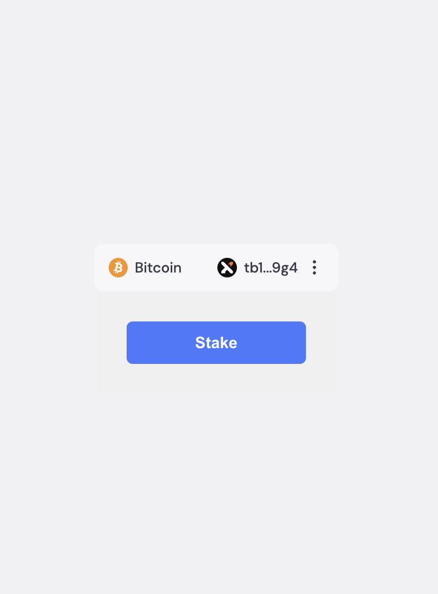

# Embedded wallet with dynamic SDK

## Env variables
- REACT_APP_ENV_ID - environment id. Get one from [Dynamic dashboard](https://app.dynamic.xyz/dashboard/developer/api). ⚠️ It's important to turn off **Create on Sign up** toggle in [SDK & API keys section](https://app.dynamic.xyz/dashboard/embedded-wallets/dynamic).
- REACT_APP_L1_CHAIN - layer1 chain id. Use e.g. *sepolia chain id* **11155111** to interact with testnet api, *ethereum chain id* **1** for mainnet api.

## Scripts
### `npm start`

Runs the app in the development mode.\
Open [http://localhost:3000](http://localhost:3000) to view it in your browser.

The page will reload when you make changes.\
You may also see any lint errors in the console.

## Staking Flow
Login using email or connect bitcoin wallet (tested with Xverse).

Clicking `Stake` button will create embedded ethereum wallet if does not exists. Signing transaction with bitcoin wallet will stake 3500 satoshi using selected strategy.